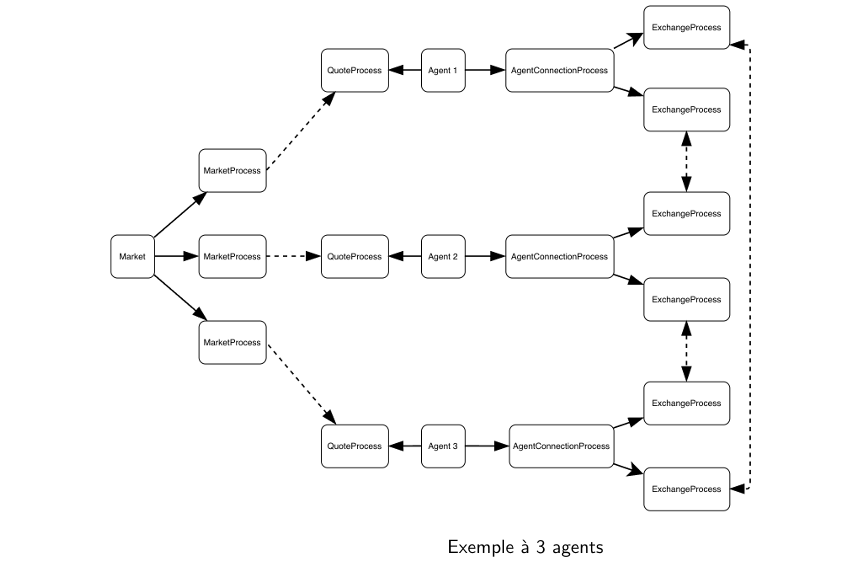
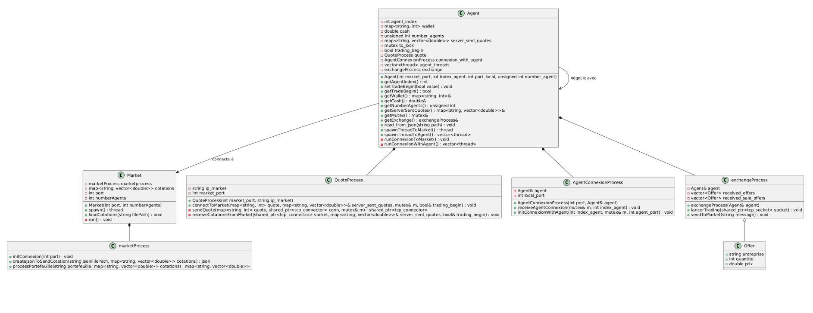

# Application de Trading Peer-to-Peer

Application distribuée de négociation de portefeuilles d'actions développée en C++. Ce système simule un marché boursier où des agents autonomes achètent et vendent des actions du CAC40 selon des stratégies personnalisées.

## Description

Le projet implémente une architecture pair-à-pair avec un serveur central (Market) qui diffuse les cotations boursières toutes les 2 minutes sur une période de 60 jours. Les agents (Agent) possèdent chacun un portefeuille d'actions et une capacité d'investissement. Ils négocient entre eux de manière autonome pour optimiser leurs portfolios selon des règles de trading configurables.

Le système repose sur deux topologies réseau distinctes : une topologie en étoile entre le Market et les Agents, et une topologie full-connected entre les Agents pour permettre les négociations directes.



## Diagramme de classes



## Fonctionnalités

**Simulation de marché**
Le serveur Market charge les données historiques du CAC40 et diffuse les cotations à intervalles réguliers. Les agents reçoivent les mises à jour et ajustent leurs stratégies en temps réel.

**Négociation autonome**
Chaque agent analyse son portefeuille et prend des décisions d'achat ou de vente selon des règles personnalisables. Les transactions se font directement entre agents sans intermédiaire.

**Synchronisation distribuée**
Le système implémente un protocole de synchronisation garantissant que tous les agents ont reçu les cotations avant de commencer les négociations. Les transactions sont coordonnées pour éviter les conflits.

**Sauvegarde des résultats**
À la fin de la session, chaque agent sauvegarde l'état de son portefeuille et son cash disponible dans un fichier JSON pour analyse ultérieure.

## Prérequis

- Compilateur C++17 ou supérieur
- CMake 3.15+
- Bibliothèques requises :
  - argparse (analyse des arguments)
  - nlohmann/json (manipulation JSON)
  - sockpp (communication TCP)
  - STL standard (threads, filesystem, random)

## Installation et exécution

Cloner le dépôt :
```bash
git clone https://github.com/AliDinarbous/Trading-App.git
cd Trading-App
```

Compiler le projet :
```bash
mkdir build && cd build
cmake ..
make
```

Lancer le serveur Market :
```bash
./market -p 8080 -n 3 -d ../data
```

Lancer les agents (dans des terminaux séparés) :
```bash
./agent -p 8081 -n 3 -i 0 -m 8080 -d ../data/agent
./agent -p 8082 -n 3 -i 1 -m 8080 -d ../data/agent
./agent -p 8083 -n 3 -i 2 -m 8080 -d ../data/agent
```

Utiliser le script Python pour automatiser le lancement :
```bash
python3 launch.py --agents 3 --market-port 8080
```

## Structure du projet

```
.
├── src/
│   ├── market/          # Code du serveur Market
│   └── agent/           # Code des agents
├── data/
│   ├── cac40.csv        # Cotations historiques
│   └── agent/           # Fichiers de configuration JSON
└── build/               # Fichiers compilés
```
